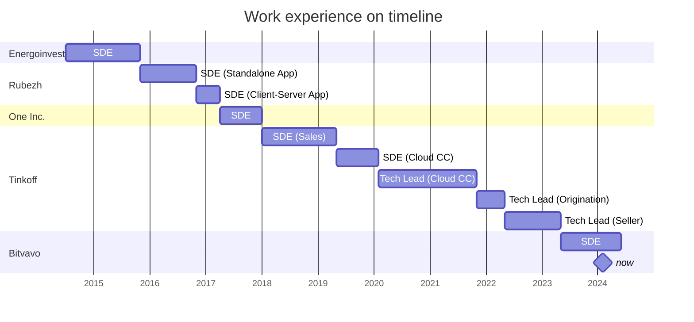

## Vladislav Ramazaev. Software Development Engineer / Tech Lead / 10 years of experience

| Date of birth | Current location | Email | LinkedIn | Telegram | GitHub |
| --- | --- | --- | --- | --- | --- |
|December 13, 1993 | Amsterdam, Netherlands | [vramazaev@vivaldi.net](vramazaev@vivaldi.net) | [@vladar107](https://www.linkedin.com/in/vladar107/?locale=en_US) | [@vladar107](https://t.me/vladar107) | [@vladar107](https://github.com/vladar107)

The primary tech stack right now is **Kotlin**, **TypeScript**.

Experienced with C#, .NET, ASP.NET Core, MongoDB, PostgreSQL, MS SQL Server, MySQL, Kafka, RabbitMQ, JavaScript/TypeScript, Angular, Kotlin, Spring, Linux containers, Docker, K8S, GitLab CI, Teamcity, GitHub Actions, AWS.

Interested in **Go**, **Haskell**, **System Design**, **Delivery Processes**.

### Experience

#### [Bitvavo](https://bitvavo.com/en) | SDE | Amsterdam, Netherlands | 06.2023 - now
As a member of the trading team, I successfully engineered two high-impact backend services from the ground up, resulting in a significant boost to PNL and becoming one step close to be MICAr complient. This involved not only developing the services but also seamlessly integrating them into the existing architecture to enhance overall trading system efficiency.

_Technologies used_: Kotlin, TypeScript, MySQL, Kafka, Docker, k8s, AWS, GitHub Actions, Terraform.

#### [Tinkoff](https://www.tinkoff.ru) | SDE/Tech Lead | St.Petersburg, Russia | 01.2018 – 05.2023
One of the most advanced Russian fintech companies ([more information](https://www.tinkoffgroup.com/company-info/summary/)). Besides project activities I've been involved in: the hiring process, mentoring (starting a common process for whole .Net SDE stream), education (as a lector at public courses), and being an active member of the internal .Net community.

##### **Tinkoff Seller** | 05.2022 - 05.2023
The project is for an aggregation marketplace but for sellers. Rich analytics and forecasting abilities are provided by ML. Engineered and launched the new project from scratch. Planned technical development plan and controlled its implementation. Organized technological process of development at team (the team was gathered for the project). 

_Technologies used_: C#, TypeScript, .Net 6, ASP.Net Core, Angular 14, PostgreSQL, Kafka, Docker, k8s, Gitlab CI.

_Approaches used_: ADR, RFC, Shift Left Testing, Technology Roadmap, TBD, 12 factors, Cloud Native

##### **Tinkoff Business. New Partners origination** | 12.2021 - 05.2022
Origination process for a new product. Engineered and launched the new project from scratch. Organized technological process of development at new team.

_Technologies used_: C#, TypeScript, .Net 6, ASP.Net Core, Angular 14, PostgreSQL, Kafka, Docker, k8s, Gitlab CI.

##### **Tinkoff Business. Cloud Call Center** | 05.2019 - 11.2021
System for calling service for business users. Firstly joined as a developer, and after a year become a technical lead. Increased product scalability, flexibility, and active client integrations by launching a universal public API. Improved Flow Efficiency and decreased Lead Time. 

_Technologies used_: C#, TypeScript, .Net 5, ASP.Net Core, Angular 12, MongoDB, Kafka, Rabbit MQ, gRPC, Docker, k8s, Gitlab CI, Teamcity.

##### **Calling Sales System** | 01.2018 - 05.2019
A system for sale by calling. One service multi-service system for selling a specific product. 

_Technologies used_: C#, TypeScript, .Net Core 2.1, ASP.Net Core, Angular 8, MongoDB, Rabbit MQ, Docker, Teamcity.

#### [One inc.](https://www.oneinc.com/) | SDE | St.Petersburg, Russia | 04.2017 – 01.2018
I've been taking part as a full-stack developer of a product for vehicle insurance (control policy's lifecycle). 

_Technologies used_: C#, TypeScript, .Net Framework 4.0, .Net Core 1.0, ASP.Net Core, MS SQL Server, Angular 2, Silverlight.

#### [Rubezh](https://rubezh.com/) | SDE | Saratov, Russia | 11.2015 - 04.2017
I've been taking part in 2 projects. Both were desktop applications for surveillance control. The first was a desktop standalone application, the second was a client-server application.

_Technologies used_: C#, XAML, C, C++, .Net Framework 4.0, WPF, WinForms, WCF, MySQL, FireBird, IP cameras, ffmpeg.

#### [Energoinvest](http://www.energoin.ru/) | SDE/Ops | Saratov, Russia | 07.2014 - 11.2015
I've been involved in the development of an energy supplier's platform. 

_Technologies used_: C#, .Net Framework 4.5, WinForms, MS SQL Server.

### Education
#### [Saratov State University](https://www.sgu.ru/en) | Saratov, Russia | 2011 - 2015
Bachelor's degree, Computer Science.
